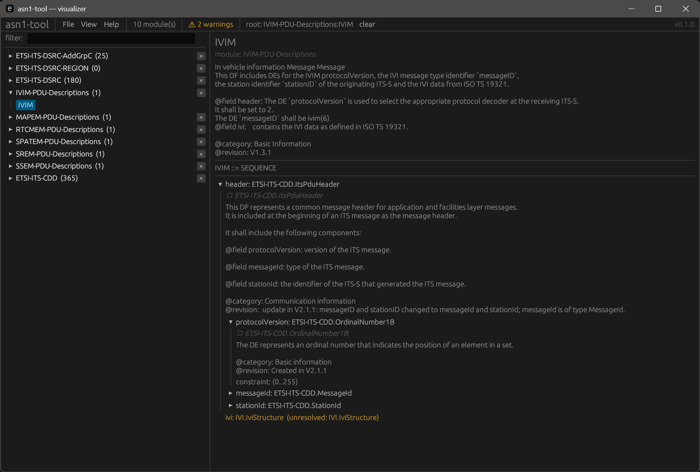

# asn1-decoder

A Rust CLI and library that parses ASN.1 specifications, generates idiomatic Java
classes from them, and provides an interactive hierarchical viewer of the parsed
specification (native GUI and standalone HTML export).

See [`AGENTS.md`](AGENTS.md) for the authoritative project contract.

## Quickstart

```bash
# Parse and semantically check a specification (prints diagnostics, no output)
cargo run -p asn1-cli -- check examples/poim

# Generate Java classes
cargo run -p asn1-cli -- generate examples/poim --out target/java \
    --java-package-prefix com.example

# Launch the interactive tree viewer (via CLI)
cargo run -p asn1-cli -- visualize examples/poim

# Or launch the standalone desktop binary
cargo run -p asn1-tool -- examples/poim

# Export a standalone HTML tree (no window)
cargo run -p asn1-cli -- visualize examples/poim --export tree.html
```

`<inputs>` accepts any mix of `.asn` files and directories; directories are
walked recursively (folders named `reference/` are skipped). Multiple inputs
are treated as a single compilation unit so cross-module `IMPORTS` resolve.

## Visualizer at a glance



- **File menu**: open / add files or directories, export HTML, close.
  "Add…" imports an additional source alongside the current set and re-parses,
  so references that were previously unresolved can now resolve.
- **Per-module `×`**: remove a module from the view without touching disk;
  references it owned become warnings.
- **View menu**: Light / Dark / Grey themes. Default follows the OS preference.
- **Diagnostics**: a warnings chip in the header opens the full list of
  unresolved references; the HTML export mirrors this as a collapsible banner.

## Workspace layout

```
crates/
  asn1-parser/         ASN.1 lexer + grammar → concrete syntax tree
  asn1-ir/             Typed intermediate representation + resolver
  asn1-codegen-java/   IR → Java source files
  asn1-codegen-cpp/    IR → C++ header files
  asn1-viz/            egui tree viewer + standalone HTML export (library)
  asn1-tool/           Standalone desktop binary — `asn1-tool(.exe)`
  asn1-cli/            User-facing binary (`asn1-decoder`)
```

## Prebuilt binaries

Each release tag (`v*`) attaches prebuilt archives to the GitHub release:

- `asn1-decoder-<tag>-<target>.{zip,tar.gz}` — the CLI (parse / generate /
  headless visualize + HTML export).
- `asn1-tool-<tag>-<target>.{zip,tar.gz}` — the standalone desktop GUI. Ships
  with an embedded icon and manifest on Windows; no installer needed.
- `asn1-tool-<tag>-<target>-portable.{zip,tar.gz}` — same binary plus a
  `portable.txt` marker that forces state (logs, crash dumps) next to the
  executable. See [`PORTABLE.md`](PORTABLE.md) for details.

## Examples

- `examples/poim/` — canonical ETSI ITS POIM spec (4 modules).
- `examples/ts103301/` — ETSI TS 103 301 ITS facilities, pulled in as a git
  submodule. Clone with `git clone --recurse-submodules` or run
  `git submodule update --init` after a plain clone.
- `examples/lte_nr_rrc_rel18.6_specs/` — 3GPP RRC Rel-18.6 sources.

## Development

```bash
cargo fmt --all
cargo clippy --workspace --all-targets -- -D warnings
cargo test --workspace
```

Pinned via `rust-toolchain.toml`; CI enforces fmt / clippy / test on Linux,
macOS, and Windows.

## License

MIT — see [`LICENSE`](LICENSE).
