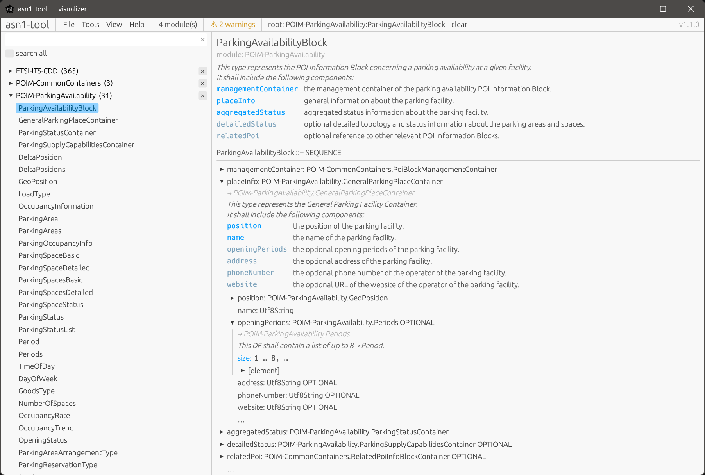

# asn1-tool

A native desktop app for exploring, validating, and code-generating from ASN.1
specifications. Open a folder of `.asn` files, drill through types and modules
in an interactive tree, and export Java / C++ sources or a self-contained HTML
view of the spec.



Built on top of a small Rust workspace that's also usable as a CLI
(`asn1-decoder`) and as embeddable libraries — see [Workspace](#workspace) and
the authoritative [`AGENTS.md`](AGENTS.md) contract.

---

## Download

Prebuilt archives are attached to every release on
[GitHub Releases](https://github.com/benkne/asn1-decoder/releases). No
installer, no runtime to install — drop the binary anywhere and run.

| Platform        | Archive                                                  |
| --------------- | -------------------------------------------------------- |
| Windows x86_64  | `asn1-tool-vX.Y.Z-x86_64-pc-windows-msvc.zip`            |
| Linux x86_64    | `asn1-tool-vX.Y.Z-x86_64-unknown-linux-gnu.tar.gz`       |

Each platform also ships a `…-portable.zip` / `…-portable.tar.gz` variant —
identical binary, plus a `portable.txt` marker that keeps logs / theme / crash
dumps next to the executable instead of in the OS user directory. See
[`PORTABLE.md`](PORTABLE.md) for the full mechanics.

**Windows SmartScreen.** The binary is unsigned, so on first run Defender will
show *"Windows protected your PC"*. Click **More info → Run anyway**, or
right-click the downloaded `.zip` → **Properties → Unblock** before extracting
to strip the Mark-of-the-Web from every file at once.

**Linux.** Built on `ubuntu-22.04` (glibc 2.35) — runs on any current
mainstream distro. Needs GTK3 / wayland / xkb runtime libs (`libgtk-3-0`,
`libxkbcommon0`, `libwayland-client0`).

---

## Using the GUI

Launch with one or more `.asn` files or directories on the command line, or
start empty and use **File → Open…**:

```
asn1-tool examples/poim
```

Directories are walked recursively; folders named `reference/` are skipped.
Multiple inputs are merged into a single compilation unit so cross-module
`IMPORTS` resolve.

**Layout.** Three-pane: top menu, left picker, central drill-down.

- **Picker.** Every module in the loaded program is a collapsible group with
  its named types underneath. The text filter at the top matches module or
  type names. Each module header has an `×` button — click it to drop that
  module from the loaded program (the file stays on disk; references it owned
  surface as new warnings).
- **Drill-down.** Click a type in the picker to make it the root. Composite
  types (`SEQUENCE` / `SET` / `CHOICE` / `ENUMERATED` / `SEQUENCE OF` / `SET
  OF`) expand in place; named-type references resolve against the IR so you
  can keep drilling through aliases until primitive leaves are reached.
  Cycles are cut off with `↺ recursive: Module.Name` instead of looping
  forever.
- **Diagnostics chip** in the header opens the full list of unresolved
  references. The HTML export mirrors this as a collapsible warnings banner.
- **ASN.1 doc comments** (`/** ... */`) are parsed: `@field` rows render as a
  two-column grid, `@category` / `@revision` / `@unit` as chips, `@note`
  paragraphs as intro prose, and inline `@ref Foo` becomes `→ Foo`. Bullet
  lists (`- item`) keep their per-line breaks.

### Menus

- **File** — Open / Add file or directory, Close. *Add* imports an additional
  source alongside the current set; references that were previously
  unresolved may now resolve.
- **Tools** — Export HTML…, Generate Java…, Generate C++….
- **View → Theme** — Light / Dark / Grey. Default follows the OS preference.
  Selection is persisted between runs in the data directory.
- **Help** — About.

### Exporting and generating

- **Export HTML.** A self-contained file (no external assets) that mirrors the
  GUI tree. Includes a Light / Dark / Grey theme picker and a collapsible
  warnings banner. Anchors are stable so you can deep-link to a type.
- **Generate Java.** One Java 17 file per named ASN.1 type. SEQUENCE-of-
  primitives without extension markers become `record`s; CHOICE becomes a
  sealed interface; ENUMERATED becomes an `enum`. Constraints emit
  constructor-side validators. Compiles clean with `javac --release 17`.
- **Generate C++.** One `.hpp` per named type. SEQUENCE / SET become `struct`s,
  CHOICE wraps `std::variant`, ENUMERATED becomes `enum class`. Cross-module
  references emit the right `#include` and qualified name.

---

## CLI

For scripting, CI, and headless workflows the same toolkit ships as
`asn1-decoder` on the same release page (`asn1-decoder-vX.Y.Z-<target>.zip`
/ `.tar.gz`, including a macOS aarch64 build).

```bash
# Validate a spec — prints diagnostics, exits non-zero on parse errors.
asn1-decoder check examples/poim

# Generate Java sources.
asn1-decoder generate examples/poim --out target/java \
    --java-package-prefix com.example

# Generate C++ headers.
asn1-decoder generate-cpp examples/poim --out target/cpp \
    --cpp-namespace example::asn1

# Open the same GUI as asn1-tool (without theme persistence).
asn1-decoder visualize examples/poim

# Or render a static HTML tree headlessly.
asn1-decoder visualize examples/poim --export tree.html
```

Unresolved references are warnings on stderr; they don't change the exit
code so partial output stays useful.

---

## Build from source

```bash
cargo build --release -p asn1-tool          # the GUI
cargo build --release -p asn1-cli           # the CLI (binary name: asn1-decoder)

# Or just run from the workspace:
cargo run -p asn1-tool -- examples/poim
cargo run -p asn1-cli  -- visualize examples/poim
```

Toolchain pinned via `rust-toolchain.toml` (stable, currently 1.95+). On
Linux, the GUI build needs GTK3 / wayland / xkb dev headers
(`libgtk-3-dev libxkbcommon-dev libwayland-dev libxcb-render0-dev
libxcb-shape0-dev libxcb-xfixes0-dev libfontconfig1-dev`).

```bash
cargo fmt --all
cargo clippy --workspace --all-targets -- -D warnings
cargo test --workspace
```

CI enforces fmt / clippy / test on Linux, macOS, and Windows.

---

## Examples

- `examples/poim/` — canonical ETSI ITS POIM spec (4 modules). Drives the
  end-to-end smoke tests; anything the tool ships with must round-trip this
  fixture without manual edits.
- `examples/ts103301/` — ETSI TS 103 301 ITS facilities, pulled in as a git
  submodule. Clone with `git clone --recurse-submodules` or run
  `git submodule update --init` after a plain clone.
- `examples/lte_nr_rrc_rel18.6_specs/` — 3GPP RRC Rel-18.6 sources.

## Workspace

```
crates/
  asn1-parser/         ASN.1 lexer + grammar → concrete syntax tree
  asn1-ir/             Typed intermediate representation + resolver
  asn1-codegen-java/   IR → Java source files
  asn1-codegen-cpp/    IR → C++ header files
  asn1-viz/            egui tree viewer + standalone HTML export (library)
  asn1-tool/           Standalone desktop binary — `asn1-tool(.exe)`
  asn1-cli/            CLI binary — `asn1-decoder(.exe)`
```

Dependency direction:

```
asn1-{tool,cli} → asn1-viz → asn1-ir → asn1-parser
              └→ asn1-codegen-{java,cpp} → asn1-ir → asn1-parser
```

## License

MIT — see [`LICENSE`](LICENSE).